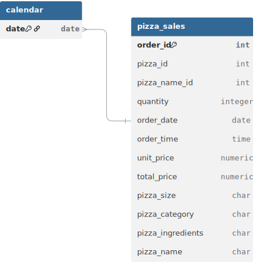

# Project Background: Maria's Kitchen Annual Sales Audit

**Maria’s Kitchen** is a high-traffic artisanal pizzeria located in the heart of **Hell's Kitchen, New York City**. Known for its signature thin-crust recipes and a diverse menu that caters to the city's fast-paced workforce and vibrant nightlife, the kitchen has become a local staple. **They were tracking their transaction data for one year and due to the rising competition challenge, now they hired me as a data analyst to** transform that raw transaction history into a strategic business decisions.

As the first dedicated analyst for the brand, I am tasked with auditing **$817.8K in annual revenue** across **48,620 line items**. This project is designed to diagnose operational bottlenecks during the Manhattan lunch rush, identify which of the 96 pizza variants are driving the bottom line, and provide a data-backed blueprint for Maria's expansion into other NYC boroughs.

Insights and recommendations are provided on the following key areas:

* **Temporal Demand & The "Golden Hour"** (Identifying Peak Sales Cycles)
* **The Sizing & Category Mix** (Analyzing Revenue Contribution by Product Type)
* **Product Portfolio Health** (Identifying Menu "Stars" and "Underperformers")
* **Transaction Dynamics** (Decoding Basket Size and Average Order Value)

**PowerQuery M Code regarding data preparation process of various tables can be found [[here]](https://github.com/mehedibhai101/Annual_Sales_Analytics_Report/tree/main/Data%20Cleaning).**

**DAX queries regarding various analytical calculations can be found [[here]](https://github.com/mehedibhai101/Annual_Sales_Analytics_Report/tree/main/DAX%20Calculations).**

**An interactive Power BI dashboard used to report and explore sales trends can be found [[here]](https://app.powerbi.com/view?r=eyJrIjoiZDMxYjU4NDEtZjkxZS00NTY2LWEzYmMtYTk2OGE5MDljZDU2IiwidCI6IjAwMGY1Mjk5LWU2YTUtNDYxNi1hNTI4LWJjZTNlNGUyYjk4ZCIsImMiOjEwfQ%3D%3D).**

---

# Data Structure & Initial Checks

The analytical engine for Maria's Kitchen is built on a streamlined Star Schema, processing a comprehensive ledger of **48,620 individual records** across the 2015 fiscal year.

* **`Fact_Sales`:** The primary transaction table tracking `pizza_id`, `order_id`, `quantity`, and `total_price`.
* **`Dim_Products`:** A lookup containing 96 unique pizza variants, mapping `pizza_name_id` to its specific `pizza_name` and `pizza_ingredients`.
* **`Dim_Categories`:** Segmenting the menu into 4 core pillars: Classic, Chicken, Supreme, and Veggie.
* **`Dim_Sizes`:** Categorizing pizzas from Small (S) to the specialty Double-Extra Large (XXL).

### Entity Relationship Diagram (ERD)

---

# Executive Summary

### Overview of Findings

Maria’s Kitchen is a high-velocity operation generating **$817.8K in revenue** with an **Average Order Value (AOV) of $38.31**. The business is fueled by a massive **12 PM Lunch Rush** and a consistent **Friday peak ($136K annual)**, highlighting a strong corporate and weekend-starter following. While the **Classic category** is the primary volume engine, the **Thai Chicken Pizza** stands as the individual revenue champion ($43.4K), indicating a customer preference for premium, flavor-forward specialty items. To scale, the kitchen must address the operational strain of the 12 PM spike and reconsider the viability of low-performing specialty sizes like XXL.

[**Visualization: Executive KPI Overview - Revenue, Orders, & Average Order Value**]

---

# Insights Deep Dive

### Category 1: Temporal Demand & The "Golden Hour"

* **The 12 PM Peak.** Revenue peaks sharply at **12 PM ($111.8K)**, accounting for the busiest single hour of the day. This is followed by a secondary "Dinner Rush" at **6 PM ($89.2K)**.
* **Friday is King.** **Friday** is the most profitable day of the week, generating **$136K**, whereas **Sunday** is the slowest day ($99K), representing a 27% revenue gap.
* **Quarterly Stability.** Sales remain remarkably consistent across the year, with **Q2 ($208K)** showing a slight edge over Q4 ($199K), suggesting a stable year-round customer base without extreme seasonal dips.
* **The 1 PM Carryover.** The lunch surge is not limited to a single hour; the **1 PM window** remains highly active ($106K), indicating a 2-hour high-intensity staffing requirement.

[**Visualization: Hourly Sales Heatmap & Weekly Revenue Trends**]

### Category 2: The Sizing & Category Mix

* **Large Size Dominance.** **Large (L)** pizzas are the primary revenue drivers, contributing **$375.3K (46% of total revenue)**. Medium ($249K) and Small ($178K) follow.
* **Classic Category Volume.** The **Classic** category is the most popular, generating **$220K**, followed closely by Supreme ($208K).
* **The XXL Anomaly.** The **XXL** size is nearly non-existent, generating only **$1,006** from just 28 units sold all year. This suggests a menu complexity that offers little financial return.
* **Price Point Sensitivity.** The most successful category (Classic) also has the most consistent pricing across sizes, making it the most predictable revenue stream for the kitchen.

[**Visualization: Revenue by Pizza Category & Size Distribution Chart**]

### Category 3: Product Portfolio Health (Stars vs. Underperformers)

* **The Revenue King.** **The Thai Chicken Pizza** is the #1 individual earner ($43.4K), proving that customers are willing to pay a premium for unique specialty flavors.
* **Top 5 Powerhouse.** The top 5 pizzas (Thai Chicken, BBQ Chicken, California Chicken, Classic Deluxe, and Spicy Italian) alone drive approximately **25% of total revenue**.
* **The "Deadweight" Bottom.** **The Brie Carre Pizza** is the lowest performer ($11.6K), significantly trailing even the second-lowest item.
* **Ingredient Correlation.** Highly successful pizzas frequently feature "Chicken" and "Peppers," suggesting these are the "safe-bet" ingredients for future menu experimentation.

[**Visualization: Top 5 vs Bottom 5 Pizzas by Revenue & Volume**]

### Category 4: Transaction Dynamics & Efficiency

* **High Attachment Rate.** With **2.32 pizzas per order** on average, customers rarely order in isolation. This points to a "Group Dining" or "Family Night" usage case.
* **The $38.31 AOV Benchmark.** The Average Order Value is relatively high for a local pizzeria, supported by the strong preference for Large sizes.
* **Order Velocity.** With **21,350 total orders**, the kitchen processes roughly **58 orders per day**, but this is skewed heavily toward peak hours, creating significant prep-time pressure.
* **Category Synergy.** Veggie and Classic pizzas are frequently paired in larger orders, serving as the "universal" options in group transactions.

[**Visualization: Average Pizza Per Order & Category-wise Sales Volume**]

---

# Recommendations:

* **Lunch Rush Staffing:** Realign staff shifts to peak specifically between **11:30 AM and 1:30 PM**. The data shows this 2-hour window is critical to total daily profitability.
* **Menu Simplification:** Immediately discontinue or move the **XXL size** to "Pre-Order Only." It accounts for less than 0.2% of revenue but adds unnecessary complexity to inventory and box stock.
* **"Sunday Family" Promotion:** To bridge the $37K gap between Friday and Sunday, launch a **"Sunday Family Bundle"** (2 Large Pizzas + Sides) to increase volume on the slowest day of the week.
* **Specialty Up-Sell:** Since the **Thai Chicken** and **BBQ Chicken** are top earners, create a "Specialty Duo" deal. Encourage customers to try these high-margin items over basic options.
* **Brie Carre Audit:** Investigate the low performance of the **Brie Carre Pizza**. If the cost of ingredients (Brie) is high, it should be removed from the menu to reduce COGS and waste.

---

## Assumptions and Caveats:

* **Ingredient Consistency:** Analysis assumes that the `unit_price` remained static throughout 2015; any mid-year price adjustments were not factored into the base calculation.
* **Size Standardization:** "XL" and "XXL" sizes were assumed to be available across all categories unless the data showed zero transactions for specific sub-types.
* **Data Completeness:** The analysis assumes 2015 represents a standard operating year without significant external disruptions (e.g., major renovations or prolonged closures).
